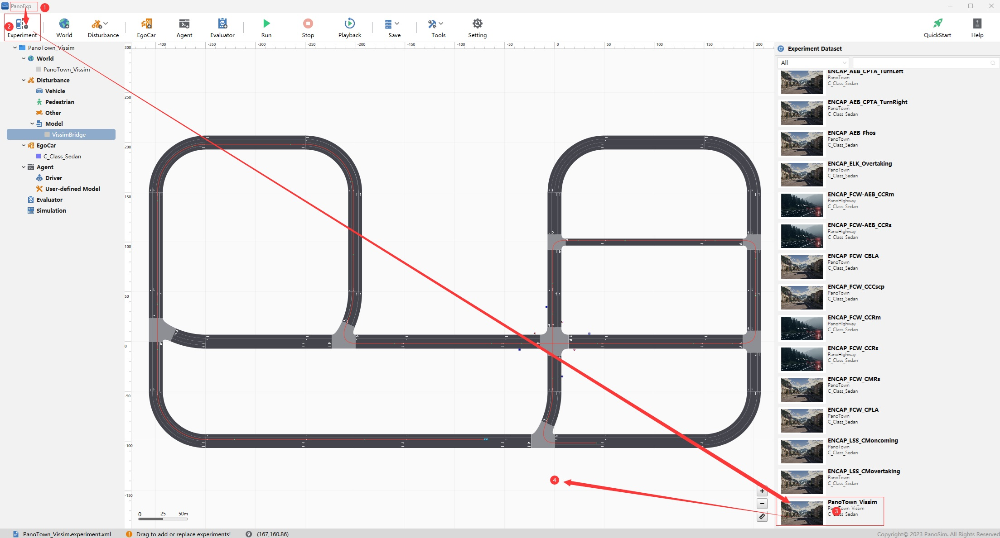
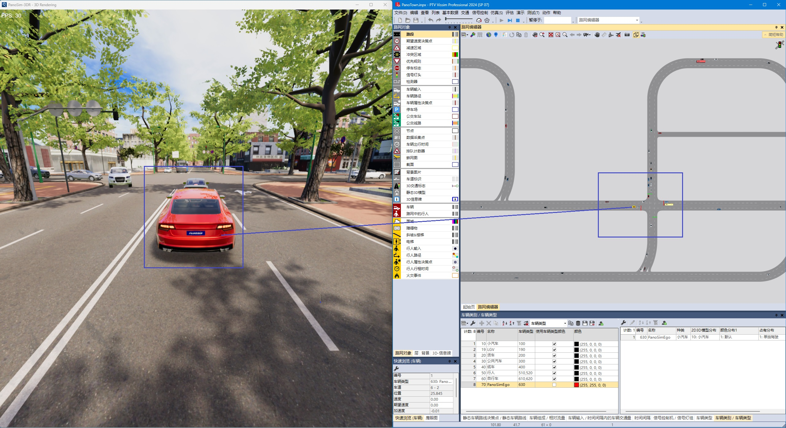

<!-- PROJECT LOGO -->

  <!--  -->
  <h1 align="center">PanoSim Vissim Bridge</h1>
  

    <b>PanoSim & Vissim Co-simulation</b>
    <!--   -->
    <!-- <a href="https://github.com/othneildrew/Best-README-Template"><strong>Explore the docs »</strong></a>
      -->
     
    <a href="https://github.com/liyanlee/PanoSim_Vissim_Bridge">View Demo</a>
    ·
    <a href="https://github.com/liyanlee/PanoSim_Vissim_Bridge/issues">Report Bug</a>
    ·
    <a href="https://github.com/liyanlee/PanoSim_Vissim_Bridge/pulls">Request Feature</a>
     
  

<!-- ABOUT THE PROJECT -->
## About
This project aims to provide a data and control bridge for the communication between [__PanoSim__](http://www.panosim.com/) and [__Vissim__](https://www.ptvgroup.com/en/products/ptv-vissim). It was tested with PanoSim **v33** and the Vissim**2024**

## Quick Start

### (1) Deployment PanoSim v33
1. [user manual](https://aic3a8owje.feishu.cn/docs/doccncuZRYgxSjNtBxTU2PXDXNF)
2. copy files(https://github.com/liyanlee/PanoSim_Vissim_Bridge/tree/main/PanoSim/PanoSimDatabase) to {PanoSimDatabase} folder

### (2) Deployment Vissim2024

1. install Vissim
2. copy files(https://github.com/liyanlee/PanoSim_Vissim_Bridge/tree/main/Vissim) to local folder

### (3) Co-Simulation
1. open experiment in PanoExp

2. configuration parameter

3. result

## Contact
If you wish to try it out, please contact us through one of the following methods.
- email: liyan.li@panosim.com
- email: pengfei.hu@panosim.com

## License
Distributed under the Apache-2.0 License. See `LICENSE` for more information.

(<a href="#readme-top">back to top</a>)

